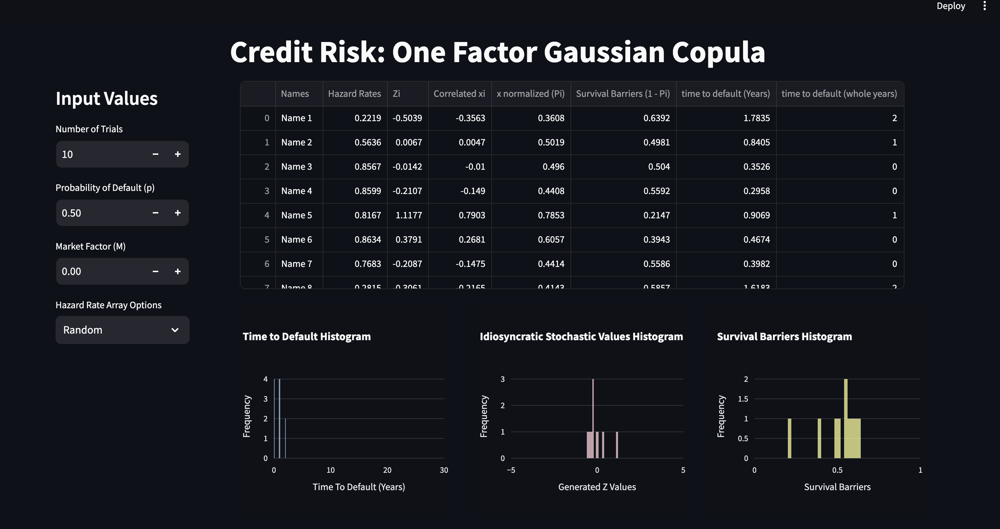

# Credit Risk: One Factor Guassian Copula Approach

## Installation
To install the project dependencies, run:
pip install -r requirements.txt

## Usage
Basic instructions on how to use the project:

On your computer, navigate to the repository's folder and type the following in the terminal:
streamlit run polyregress.py

note: depending on your python setup, you may have to include 'python' or 'python3' in front of the command.

## Project Structure
Overview of the project's structure:

project-root/

├── py/ - polyregress - polynomial regression model.

├── py/ - webscrape - extracts data using selenium drivers from webpage.

├── csv/ - JPcashflow - extracted data in csv form.

├── png/ - Dashboard_Preview - Preview of dashboard.

├── requirements.txt - Project dependencies.

├── .gitatributes - Text handling.

└── README.md - This file.

## Contact Information
For questions, please contact David Bannister at (https://www.linkedin.com/in/david-bannister-230a67191/).